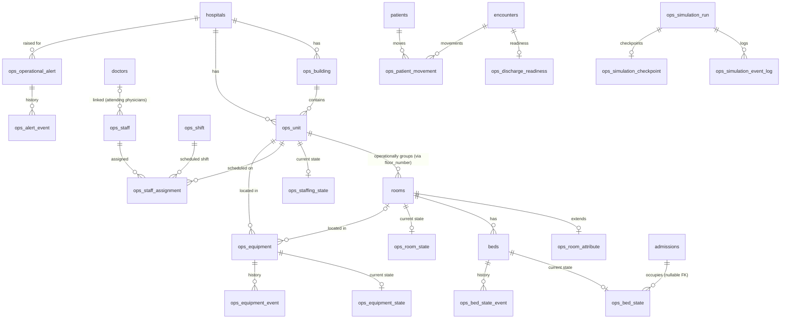

# Hospital Operations — Existing Model Analysis

> Phase 1 deliverable. Produced by inspecting the actual repository (README.md,
> requirements.txt, `.env.example`, `scripts/build_fabric_notebook.py`,
> `scripts/build_validation_notebook.py`, `scripts/deploy_notebook.py`,
> `scripts/run_fabric_notebook.py`, `scripts/validate_fabric_data.py`, and the
> deployed Fabric SQL database itself) — **not** assumed from the feature request.
> Every table/column name below was confirmed against the actual DataFrame
> construction code and/or a live `validate_fabric_data.py` run, not the (slightly
> stale) prose in `README.md`.

## 0. Important repo-architecture fact that shapes this whole design

As of the 2026-08-17 cleanup (see `/memories/repo/fabric-deployment.md`), this
repository is **Fabric-notebooks-only**: there is no `src/` package anymore, and
the two production notebooks are fully self-contained (no local-module imports)
because a notebook running headlessly inside Fabric has no access to this git
repo's filesystem. The two new Hospital Operations notebooks reuse the
`src/hospital_operations/` Python package described later in this document —
this makes them **local / VS Code Jupyter notebooks that connect to the same
Fabric SQL database via `CONNECTION_STRING`**, the same pattern already
documented in `.env.example` for "local/manual notebook testing outside Fabric".
They are not (yet) designed to be deployed as headless Fabric Jobs the way the
generator is. This is called out again in
[HOSPITAL_OPERATIONS_ARCHITECTURE.md](HOSPITAL_OPERATIONS_ARCHITECTURE.md) as a
known limitation with a documented evolution path.

---

## 1. Catalog of existing tables and views

### 1.1 Clinical / reference tables (owned by the Healthcare Data Generator — **read-only** to the new capability)

| Table | Row count (2026-08-17) | Purpose |
|---|---|---|
| `date_dim` | 594 | Calendar dimension |
| `hospitals` | 10 | Hospital master data |
| `departments` | 38 | Departments per hospital |
| `hospital_department_beds` | 22,572 | Daily bed-allocation snapshot per hospital/department |
| `patients` | 29,700 | Patient demographics |
| `doctors` | 2,970 | Providers |
| `encounters` | 5,070,203 | ED/clinic/inpatient encounters |
| `admissions` | 2,233,960 | Admission/discharge records |
| `diagnoses` | 5,178,065 | ICD-10 diagnoses per encounter |
| `procedures` | 59,400 | Procedures per encounter |
| `medications` | 74,250 | Medications per encounter |
| `labs` | 103,950 | Lab results per encounter |
| `insurance` | 29,700 | Insurance/payer per patient |
| `billing` | 30,150 | Charges/claims per encounter |
| `run_logs` | 9 | Generator run audit trail (legacy schema, see §9) |
| `notebook_diagnostics` | 12 | Headless-run debugging breadcrumbs |
| `floors` | 38 | Hospital floor **and** department/unit definition (see §9 — no surrogate key) |
| `rooms` | 951 | Individual rooms |
| `beds` | 1,885 | Individual beds |
| `patient_bed_assignments` | 3,433 (current) | Current + recent patient→bed occupancy |

### 1.2 Existing views (all owned by the generator)

| View | Purpose |
|---|---|
| `vw_current_er_beds` | ER bed count by hospital (from `hospital_department_beds`) |
| `vw_current_patient_beds` | Total/occupied/available beds by hospital |
| `vw_floor_plan` | Every bed/room/floor + current occupant |
| `vw_patient_location` | Patient-centric location + clinical picture |
| `vw_floor_occupancy` | Floor-level occupancy rollup |
| `vw_hospital_status` | Hospital-wide occupancy/acuity rollup |

---

## 2. Primary keys and foreign keys (as actually implemented — no `ALTER TABLE ... FOREIGN KEY` constraints exist anywhere; all relationships are enforced only in application code via `pandas.to_sql`)

| Table | Primary key (informal) | Foreign keys (informal) |
|---|---|---|
| `hospitals` | `hospital_id` | — |
| `departments` | `department_id` | `hospital_id` → `hospitals` |
| `hospital_department_beds` | (`hospital_id`,`department_id`,`date`) | `hospital_id` → `hospitals`, `department_id` → `departments` |
| `patients` | `patient_id` | `hospital_id` → `hospitals` |
| `doctors` | `provider_id` | `hospital_id` → `hospitals` |
| `encounters` | `encounter_id` | `hospital_id`, `department_id`, `patient_id`, `provider_id` |
| `admissions` | `admission_id` | `encounter_id`, `hospital_id`, `patient_id`, `department_id` |
| `diagnoses` | `diagnosis_id` | `encounter_id` |
| `procedures` | `procedure_id` | `hospital_id`, `encounter_id` |
| `medications` | `medication_id` | `encounter_id` |
| `labs` | `lab_id` | `encounter_id` |
| `insurance` | `insurance_id` | `patient_id` |
| `billing` | `billing_id` | `encounter_id`, `patient_id` |
| `floors` | **none** — natural key (`hospital_id`,`floor_number`) | `hospital_id` → `hospitals` |
| `rooms` | `room_id` | `hospital_id`, `floor_number` (→ `floors` natural key) |
| `beds` | `bed_id` | `room_id` → `rooms`, `hospital_id`, `floor_number`, `room_number` (denormalized) |
| `patient_bed_assignments` | `assignment_id` | `admission_id`, `patient_id`, `hospital_id`, `bed_id` |

## 3. Existing columns relevant to hospital operations

- `hospitals.bed_count`, `hospitals.specialty` — hospital-level bed capacity + specialty routing already drive floor/bed generation.
- `hospital_department_beds.beds_allocated` (per date) — aggregate department bed allocation; this is the number that new operational bed inventory must reconcile to (see §9).
- `floors.capacity`, `floors.bed_type`, `floors.department` — capacity and clinical type per floor/unit.
- `rooms.bed_count`, `rooms.room_type` — room-level bed capacity, single/double/quad.
- `beds.status` (`'Available'`/`'Occupied'`) — a coarse operational status the generator itself maintains; the new `ops_bed_state` table supersedes this with a richer, more frequently-updated state machine without touching this column.
- `patient_bed_assignments.patient_status`, `.diagnosis_code`, `.los_days` — existing "clinical status" proxy the new discharge-readiness/acuity logic can draw on as a starting point.
- `admissions.admit_datetime` / `.discharge_datetime` and `encounters.encounter_date` — the time backbone new patient-movement/discharge-readiness events must stay consistent with (no synthetic movement before admission, no discharge before admission, etc.)

## 4. Existing entities that will be reused (never duplicated)

`hospitals`, `departments`, `patients`, `doctors` (as attending/ordering providers), `encounters`, `admissions`, `diagnoses`, `rooms`, `beds`. The new package treats all of these as **read-mostly upstream dependencies** — the only exception is that `ops_bed_state`/`ops_room_state` become the operational source of truth for "is this bed/room usable right now", read alongside (not instead of) `beds.status`.

## 5. Missing operational entities (confirmed absent anywhere in the schema)

Building, floor-vs-unit distinction (currently conflated), staff/shift/staffing coverage, equipment inventory/state/events, room floor-plan coordinates, isolation/negative-pressure/telemetry flags, bed operational state machine (cleaning/blocked/discharge-pending), patient-movement/transfer log, discharge-readiness tracking, operational alerting, and any simulation run/checkpoint/control mechanism. None of this exists today — everything in §"New Reference and Hierarchy Tables" of the request is genuinely new.

## 6. Proposed extensions

See [HOSPITAL_OPERATIONS_DATA_DICTIONARY.md](HOSPITAL_OPERATIONS_DATA_DICTIONARY.md) for the full column-level spec. Summary of the mapping decisions:

| Conceptual entity (from request) | Decision |
|---|---|
| Health System | Not modeled as a table (only 1 conceptual system) — represented only in `vw_ops_health_system_snapshot`. |
| Hospital | **Reuse** `hospitals` as-is. |
| Building | **New** `ops_building` (1+ per hospital; hospitals table has no building concept). |
| Floor | `floors` already conflates floor+unit into one row (see §9). Physical floor number is reused as `ops_unit.source_floor_number`; no separate physical-floor table is created (would be a redundant shadow of `floors`). |
| Unit | **New** `ops_unit`, one row per existing `floors` row, joined via the natural key (`hospital_id`,`floor_number`) since `floors` has no surrogate key. Adds unit type/specialty/staffing target attributes `floors` doesn't have. |
| Room | **Reuse** `rooms.room_id`. **New** `ops_room_attribute` (1:1 extension keyed by `room_id`) adds floor-plan coordinates and isolation/telemetry/private-room flags without duplicating room/bed-count/room_type. |
| Bed | **Reuse** `beds.bed_id` — no new identity table. `ops_bed_state`/`ops_equipment`/`ops_staff_assignment` all FK directly to `beds.bed_id`. |
| Active Encounter / Patient | **Reuse** `encounters`, `admissions`, `patients`, `patient_bed_assignments` directly; new `ops_patient_movement`/`ops_discharge_readiness` add operational layers keyed by `encounter_id`/`patient_id`. |

All new tables use an **`ops_` table-name prefix** (not a dedicated `hospital_operations` SQL schema). Rationale: this repository has never used non-`dbo` schemas anywhere, Fabric SQL Database's support for custom schemas alongside pandas `to_sql`/raw-pyodbc patterns already in use here is unverified, and a prefix is guaranteed to work identically on SQL Server, Azure SQL Database, and Fabric SQL Database (Principle #13). This is flagged as an assumption in §10.

## 7. Entity-relationship diagram

## 8. Source-to-target mapping

| Source (existing) | Target (new) | Mapping rule |
|---|---|---|
| `hospitals.hospital_id` | `ops_building.hospital_id`, `ops_unit.hospital_id`, `ops_equipment.hospital_id`, `ops_staff.primary_hospital_id`, `ops_operational_alert.hospital_id` | Direct FK reuse |
| `floors` (`hospital_id`,`floor_number`,`department`,`bed_type`,`capacity`) | `ops_unit` | 1 new `ops_unit` row per existing `floors` row; `unit_type`/`clinical_specialty` derived from `bed_type`/`department`; `licensed_bed_count` seeded from `capacity` |
| `departments.department_id` | `ops_unit.department_id` (nullable) | Matched by `hospital_id` + case-insensitive name-contains against `floors.department` where possible; left `NULL` when no confident match (documented, not invented) |
| `rooms.room_id` | `ops_room_attribute.room_id` | Direct 1:1 FK |
| `beds.bed_id` | `ops_bed_state.bed_id`, `ops_equipment.room_id`/unit joins, `ops_staff_assignment.bed_id` | Direct FK reuse, no shadow bed table |
| `patient_bed_assignments` (open assignments) | `ops_bed_state` initial load | Beds with an open assignment (`discharged_datetime IS NULL`) seeded `occupancy_status='Occupied'`; all others `'Available'` |
| `admissions`, `encounters`, `patients` | `ops_discharge_readiness`, `ops_patient_movement` | Only **active** (non-discharged) admissions get an initial `ops_discharge_readiness` row |
| `doctors.provider_id` | `ops_staff.existing_provider_id` | Physician-role `ops_staff` rows reuse a real `provider_id` at the hospital instead of inventing a duplicate person; non-physician roles (RN, tech, etc.) are synthetic-only (`existing_provider_id IS NULL`) |
| `hospital_department_beds.beds_allocated` (latest date) | Setup-notebook reconciliation check only (not copied into any ops table) | `SUM(ops_unit.staffed_bed_count)` per hospital is validated against the latest `beds_allocated` sum and reported (not enforced) since the two are generated by unrelated processes |

## 9. Concerns about current data quality / referential integrity

1. **No enforced FKs anywhere.** All relationships (including the ones this project adds) rely on application-level discipline. The Setup/validation scripts must actively check orphans since the database won't.
2. **`floors` has no surrogate key.** It's addressed only via the natural key (`hospital_id`,`floor_number`). `ops_unit` must use this natural key with a `UNIQUE` constraint to avoid silently creating duplicate units on re-run.
3. **`beds`, `rooms`, and `patient_bed_assignments` are fully replaced (`to_sql(if_exists='replace')`) by the generator's Cell 9/11**, not appended. `bed_id`/`room_id` numbering is deterministic *given an unchanged hospital/floor configuration*, but is **not guaranteed stable** if hospital count, `HOSPITAL_BED_SCALE`, or floor-generation logic ever changes. Any new table that FKs to `bed_id`/`room_id` can go stale after such a change. **Mitigation**: the Setup notebook is fully idempotent and re-runnable, and `validation.py` includes an explicit orphan-check for `ops_*` rows pointing at `bed_id`/`room_id` values no longer present in `beds`/`rooms`.
4. **`run_logs` has two incompatible historical schemas** (see `/memories/repo/fabric-deployment.md`) — irrelevant to this project since `ops_simulation_run` is a brand-new table, but noted so nobody confuses the two.
5. **Pre-existing legacy billing orphans were already cleaned up** (2026-08-17) — not a concern for this work, mentioned for completeness.
6. **README.md's "Database Schema" table lists `hospitals.city`/`state` columns that do not actually exist** in the generated table (only `hospital_id`, `name`, `bed_count`, `specialty`). `ops_building.latitude`/`longitude` are therefore **synthetic map coordinates generated by the ops Setup notebook**, not derived from any real hospital location field.

## 10. Assumptions requiring confirmation

1. **`ops_` prefix instead of a dedicated SQL schema** — chosen for cross-platform compatibility (see §6). If a real `hospital_operations` schema is later confirmed supported end-to-end in the target Fabric SQL Database, tables can be migrated with `ALTER SCHEMA ... TRANSFER`.
2. **One `ops_building` per hospital by default** (named `"Main Campus"`), since no existing data suggests multi-building campuses. Configurable via `hierarchy_generator.py` if a demo wants multiple buildings per hospital.
3. **`ops_unit` maps 1:1 to existing `floors` rows.** If a future generator change puts multiple departments on one floor number, this mapping would need revisiting.
4. **Charge-nurse/staff synthetic names use `Faker`**, consistent with the rest of the repo (`faker` is already a dependency) — no real employee data, ever.
5. **Discharge-readiness/acuity fields are explicitly simulated**, not clinically derived, per the request's demo-safety rules — labelled as such in the data dictionary and in every notebook's disclaimer cell.

## 11. Classification of all new/existing objects

| Class | Objects |
|---|---|
| **Existing source tables** (never modified) | `hospitals`, `departments`, `hospital_department_beds`, `patients`, `doctors`, `encounters`, `admissions`, `diagnoses`, `procedures`, `medications`, `labs`, `insurance`, `billing`, `date_dim`, `floors`, `rooms`, `beds`, `patient_bed_assignments`, `run_logs` |
| **New reference/hierarchy tables** (rarely change) | `ops_building`, `ops_unit`, `ops_room_attribute`, `ops_shift` |
| **New current-state tables** (upserted) | `ops_staffing_state`, `ops_equipment_state`, `ops_room_state`, `ops_bed_state`, `ops_discharge_readiness`, `ops_operational_alert`, `ops_simulation_control`, `ops_simulation_checkpoint`, `ops_simulation_run` (status/counters updated in place per iteration) |
| **New append-only historical/event tables** | `ops_equipment_event`, `ops_bed_state_event`, `ops_patient_movement`, `ops_alert_event`, `ops_simulation_event_log` |
| **New staffing operational tables** | `ops_staff`, `ops_staff_assignment` |
| **New application snapshot views** | `vw_ops_health_system_snapshot`, `vw_ops_hospital_snapshot`, `vw_ops_building_snapshot`, `vw_ops_floor_snapshot`, `vw_ops_unit_snapshot`, `vw_ops_room_snapshot`, `vw_ops_bed_snapshot`, `vw_ops_patient_operations_snapshot`, `vw_ops_active_alerts`, `vw_ops_equipment_availability`, `vw_ops_staffing_coverage`, `vw_ops_patient_flow`, `vw_ops_floor_plan` |

> Note: the new snapshot views are named with a `vw_ops_` prefix rather than the
> exact `vw_floor_plan`/`vw_hospital_snapshot`-style names in the request, because
> `vw_floor_plan` already exists as a generator-owned view — reusing that name
> would silently overwrite it. All 13 requested snapshot views exist, just
> consistently namespaced.
